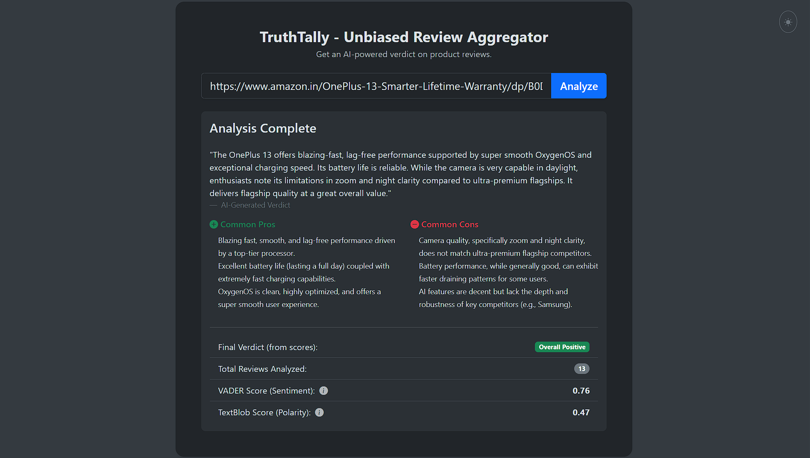

# TruthTally - Unbiased Review Aggregator 🛍️🤖

TruthTally is a full-stack web application that helps users make better purchasing decisions. It scrapes product reviews from Amazon, analyzes sentiment using NLP libraries, and leverages the Google Gemini API to generate an unbiased, AI-written verdict with Pros & Cons.



## 🌟 Features

-   **Automated Web Scraping:** Uses Selenium to fetch real-time reviews from Amazon product pages.
-   **Sentiment Analysis:** Calculates polarity and sentiment scores using TextBlob and VADER.
-   **AI Summarization:** Uses Google's Gemini Flash model to read all reviews and generate a human-like verdict.
-   **Smart Data Extraction:** Automatically categorizes "Common Pros" and "Common Cons".
-   **Modern UI:** Clean interface built with Bootstrap 5, featuring Dark Mode support.

## 🛠️ Tech Stack

-   **Backend:** Python, Flask
-   **Automation:** Selenium, WebDriver Manager
-   **AI & NLP:** Google Generative AI (Gemini), TextBlob, VADER Sentiment
-   **Frontend:** HTML5, CSS3, Bootstrap 5, JavaScript

## 🚀 How to Run Locally

1.  **Clone the repository**
    ```bash
    git clone [https://github.com/mayukhp24/Unbiased-Review-Aggregator.git](https://github.com/mayukhp24/Unbiased-Review-Aggregator.git)
    cd Unbiased-Review-Aggregator
    ```

2.  **Create a Virtual Environment**
    ```bash
    python -m venv venv
    # Windows:
    venv\Scripts\activate
    # Mac/Linux:
    source venv/bin/activate
    ```

3.  **Install Dependencies**
    ```bash
    pip install -r requirements.txt
    ```

4.  **Set up Environment Variables**
    Create a `.env` file in the root directory and add your Google Gemini API key:
    ```
    GEMINI_API_KEY=your_api_key_here
    ```

5.  **Run the App**
    ```bash
    python app.py
    ```
    Open your browser and go to `http://127.0.0.1:5000`

## ⚠️ Note
This tool requires **Google Chrome** to be installed on the machine.

## ☁️ Deploying to Render

The repo includes a `Dockerfile` (bundles headless Chromium so Selenium works in the container) and a `render.yaml` Blueprint.

1.  Push this repo to your own GitHub account.
2.  In Render, choose **New +** → **Blueprint** and select the repo.
3.  Render reads `render.yaml` and prompts you for the `GEMINI_API_KEY` value — enter it there. It's stored as an encrypted environment variable on Render and is never written to the repo.
4.  Deploy. Render builds the Docker image and runs the app with Gunicorn.

Your API key only ever lives server-side (Render's env vars); visitors to the deployed app can use the `/analyze` endpoint but never see the key itself.